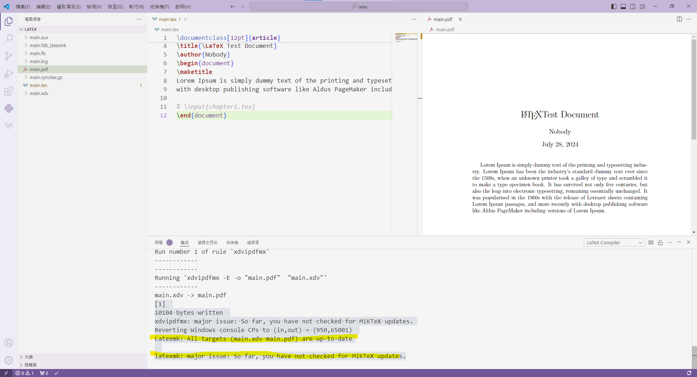
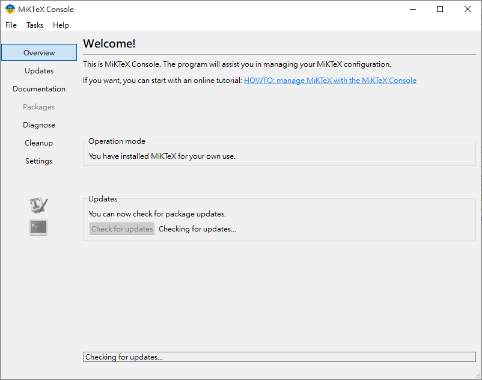
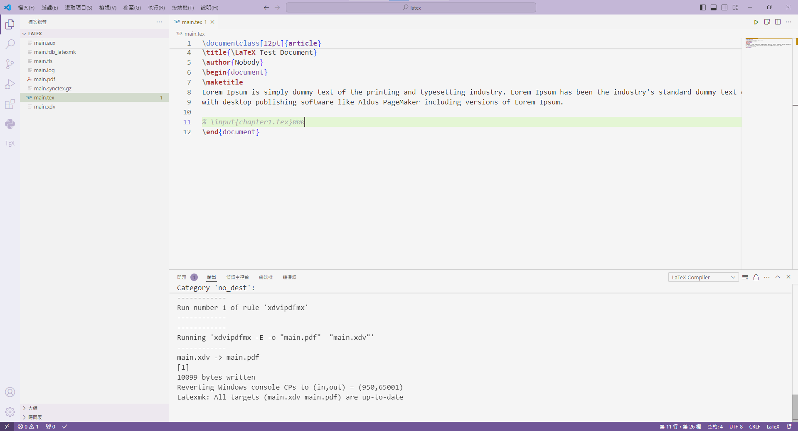

第一步  
先依據這網址來安裝  
[點這](https://hackmd.io/@WeiHeng/rkxi0RC-2)

接者，若檔案路徑中有中文，或是之後撰寫的內容有中文
需參考以下[文章](https://zhuanlan.zhihu.com/p/38178015)  
這當中有說明，面對中文路徑時的解決辦法

```latex
% 這是下圖中，main.tex的內容
\documentclass[12pt]{article}
\usepackage{xeCJK}
% \setCJKmainfont{NotoSansTC-Regular.otf}
\title{\LaTeX Test Document}
\author{Nobody}
\begin{document}
\maketitle
Lorem Ipsum is simply dummy text of the printing and typesetting industry. Lorem Ipsum has been the industry's standard dummy text ever since the 1500s, when an unknown printer took a galley of type and scrambled it to make a type specimen book. It has survived not only five centuries, but also the leap into electronic typesetting, remaining essentially unchanged. It was popularised in the 1960s with the release of Letraset sheets containing Lorem Ipsum passages, and more recently 
with desktop publishing software like Aldus PageMaker including versions of Lorem Ipsum.

% \input{chapter1.tex}000
\end{document}
```


目前遇到第一個問題，在單純轉譯英文資料時，雖然可以順暢的轉過去，但是點開log，會發現仍有一些小型錯誤。


---------
打開MikTex並更新 >check for updates


點擊更新按鈕後，上述問題即可解決。

到了這邊，先檢查兩件事
1.  存檔後，是否可以自動生成PDF
2.  在命令區，xelatex是否是第一個

