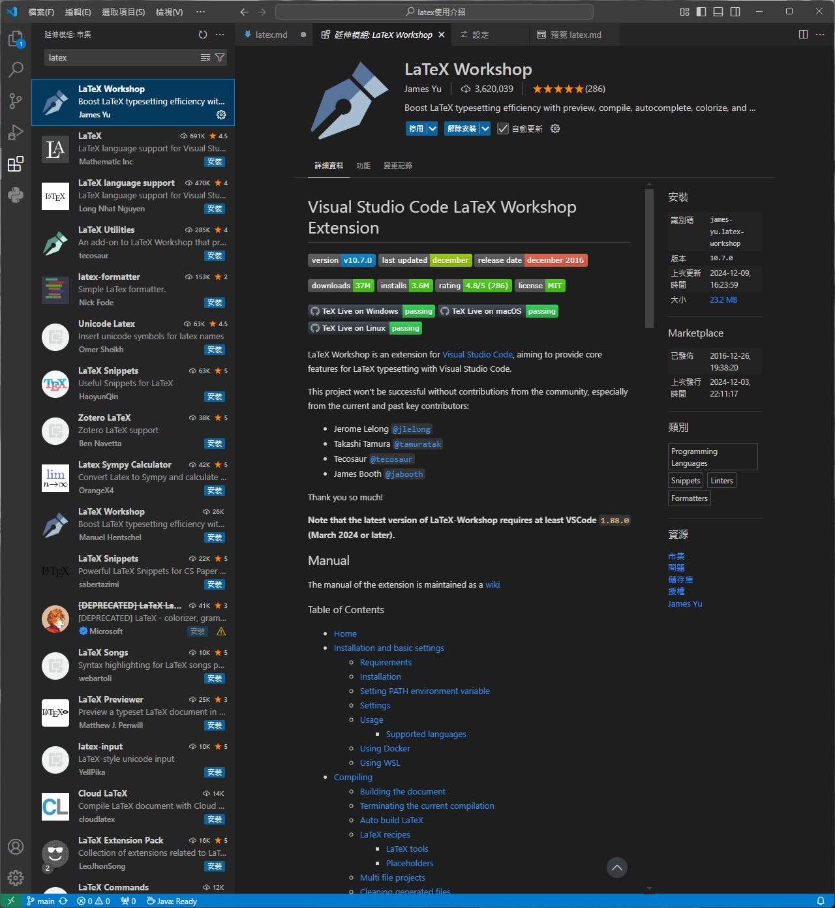
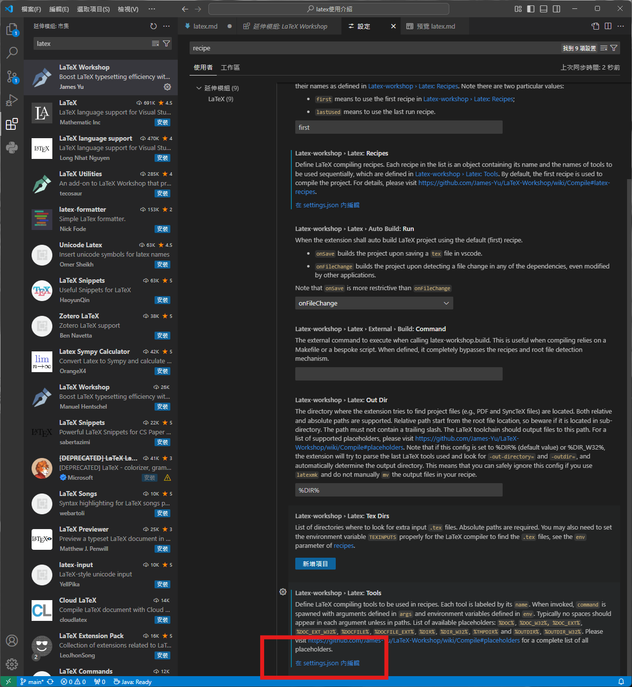
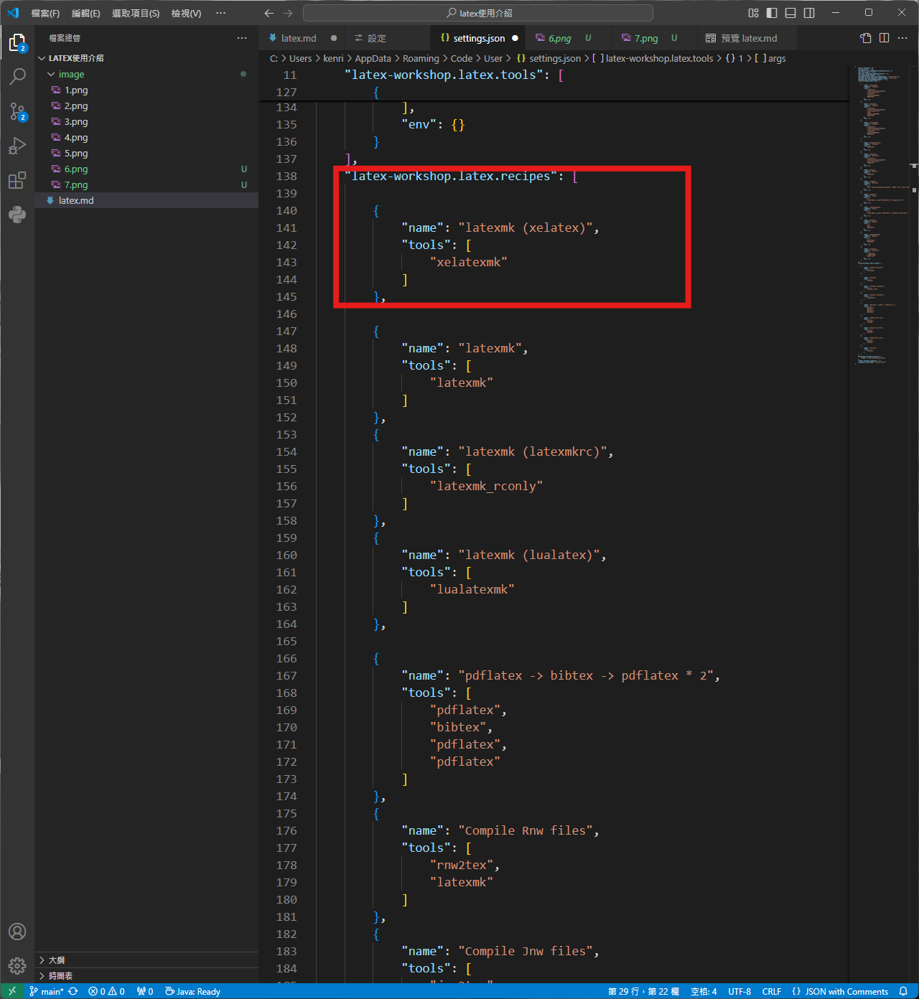
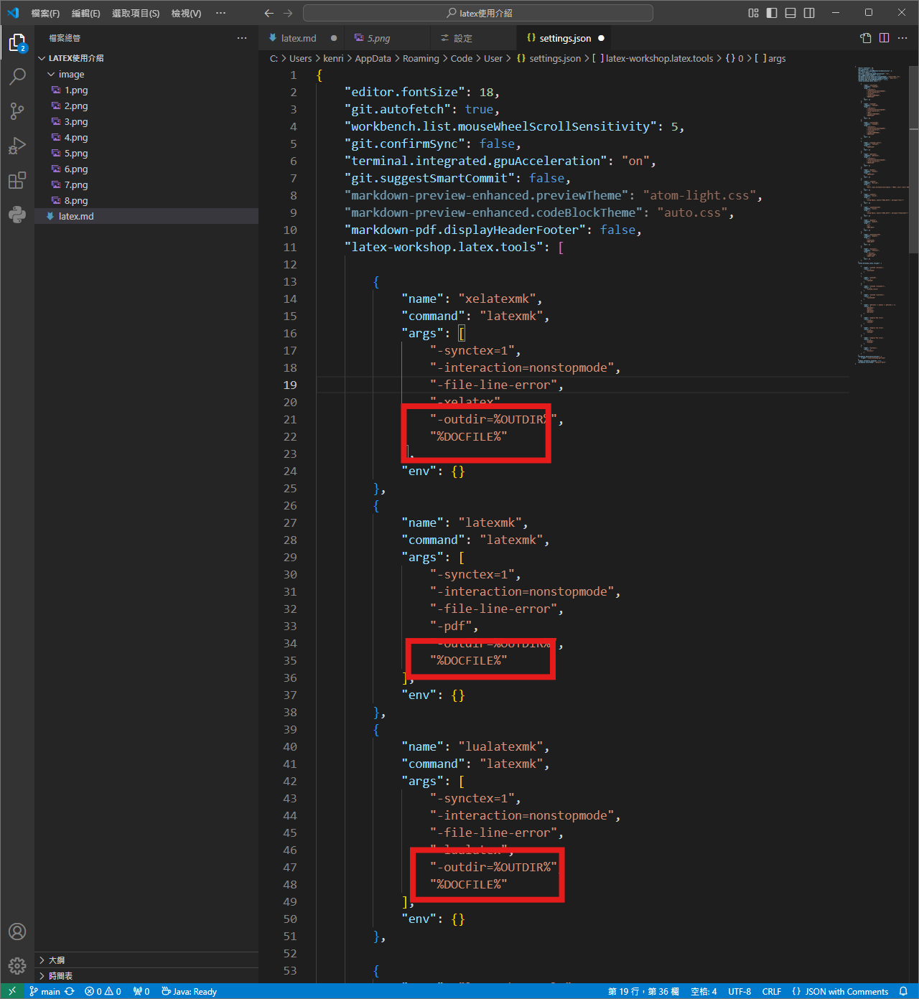
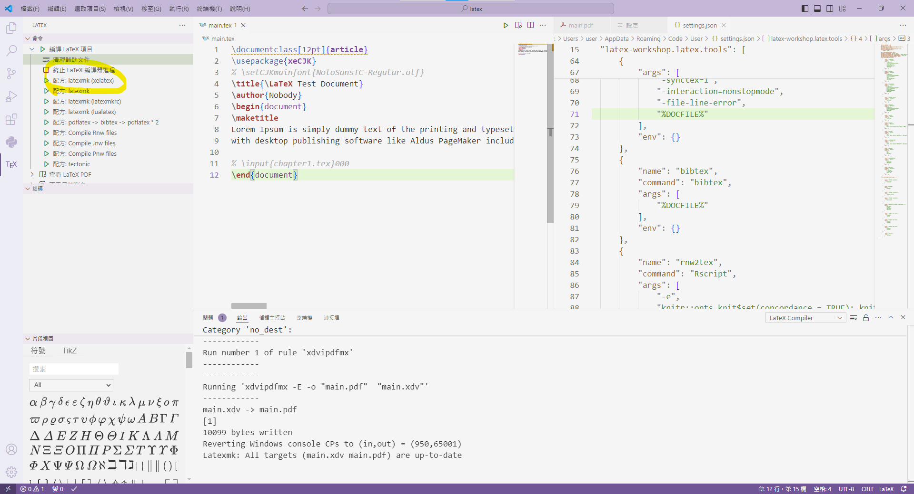
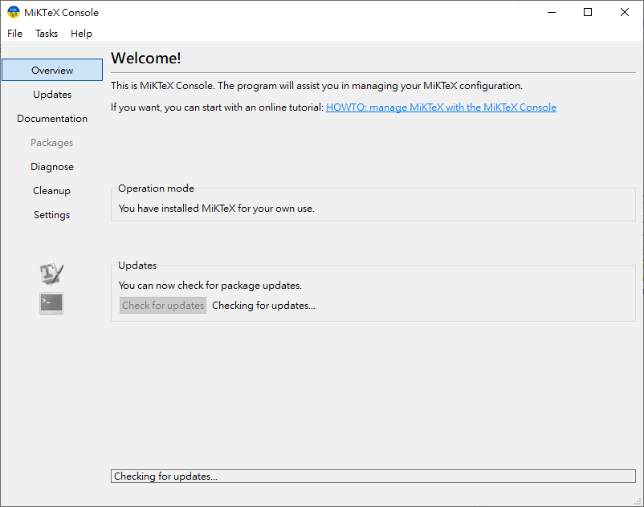
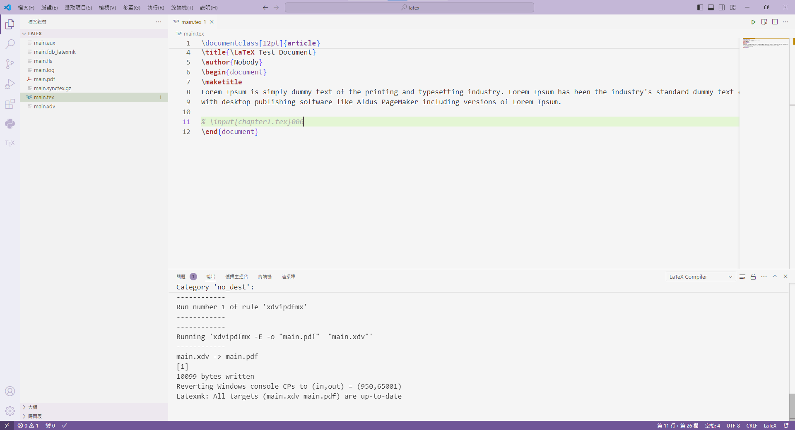

#   在vscode 上編寫 LaTeX
##   第一步  
選擇其中一個發行版安裝，目前有兩大主流:TeXLive和MiKTeX  
其實裝哪一個都沒差，並不會影響實際使用體驗  
我是裝[MiKTeX](https://miktex.org/download)，他跟TeXLive最大的差別是在他並不會一次就把所有的packages全部下載(全部也才5GB，所以真的沒差)，等到需要用到時才會彈窗提示你要下載。[資料來源](https://medium.com/@Yich_2826/latex-latex%E5%92%8Cxelatex%E5%AE%89%E8%A3%9D%E5%BF%83%E5%BE%97-9ca78cf583b8)  

##   第二步  
安裝完MiKTeX後，點開，安裝[Perl](https://strawberryperl.com/)  
##   第三步 
來到VScode，安裝LaTeX Workshop  



##   第四步  
因為之後撰寫的文章高機率會有中文，所以我們需要將xelatex 放在第一順位  
*   點左下齒輪打開設定，進入到`settings`搜尋`recipe`，然後點擊`Edit in settings.json`  
  
*   在設定檔內找到`latexmk (xelatex)`，並將其移動到{}中的最上方  
  
資料來源:  
https://hackmd.io/@WeiHeng/rkxi0RC-2


##   第五步  
接者，若檔案路徑中有中文，還需要再做一件事  
先進入剛剛的`Edit in settings.json`  
把 %DOC% 更改成 %DOCFILE%  


資料來源:  
https://zhuanlan.zhihu.com/p/38178015  

到這邊基本上就完成了!
###  到了這邊，先檢查兩件事
1.  存檔後，是否可以**自動**生成PDF
2.  在命令區，xelatex是否是第一個

如果這兩點都通過的話，可以試著在文檔區中打入一些中文，看是否能正常運行

```latex
\documentclass[12pt]{article}
\usepackage{xeCJK}
\xeCJKsetup{AutoFakeBold=true, AutoFakeSlant=true}
\setCJKmainfont{標楷體}
\setmainfont{Times New Roman}
% \setCJKmainfont{NotoSansTC-Regular.otf}
\title{\LaTeX Test Document}
\author{Nobody}
\begin{document}
\maketitle
Lorem Ipsum is simply dummy text of the printing and typesetting industry. Lorem Ipsum has been the industry's standard dummy text ever since the 1500s, when an unknown printer took a galley of type and scrambled it to make a type specimen book. It has survived not only five centuries, but also the leap into electronic typesetting, remaining essentially unchanged. It was popularised in the 1960s with the release of Letraset sheets containing Lorem Ipsum passages, and more recently 
with desktop publishing software like Aldus PageMaker including versions of Lorem Ipsum.

我是中文字
\end{document}
```

---
##   練習網站
https://youtu.be/mQamBS6uTOc?si=EQ4w6s5K-QXGBi61  
https://youtu.be/NYm7cXVtSO0?si=Nf-HNIfaFaVmp0zp  


##  之前遇到的問題
目前遇到第一個問題，在單純轉譯英文資料時，雖然可以順暢的轉過去，但是點開log，會發現仍有一些小型錯誤。
```latex
% 這是下圖中，main.tex的內容
\documentclass[12pt]{article}
\usepackage{xeCJK}
% \setCJKmainfont{NotoSansTC-Regular.otf}
\title{\LaTeX Test Document}
\author{Nobody}
\begin{document}
\maketitle
Lorem Ipsum is simply dummy text of the printing and typesetting industry. Lorem Ipsum has been the industry's standard dummy text ever since the 1500s, when an unknown printer took a galley of type and scrambled it to make a type specimen book. It has survived not only five centuries, but also the leap into electronic typesetting, remaining essentially unchanged. It was popularised in the 1960s with the release of Letraset sheets containing Lorem Ipsum passages, and more recently 
with desktop publishing software like Aldus PageMaker including versions of Lorem Ipsum.

% \input{chapter1.tex}000
\end{document}
```

---------
打開MikTex並更新 &rarr; check for updates  


點擊更新按鈕後，上述問題即可解決。


