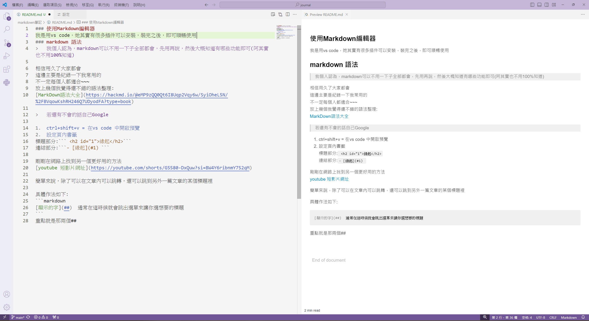
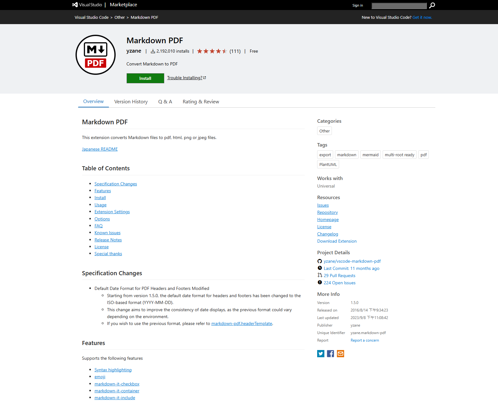
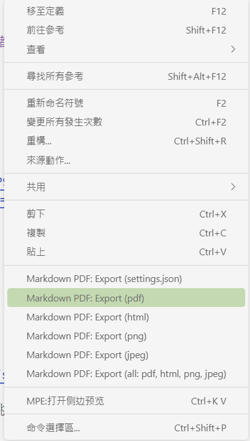
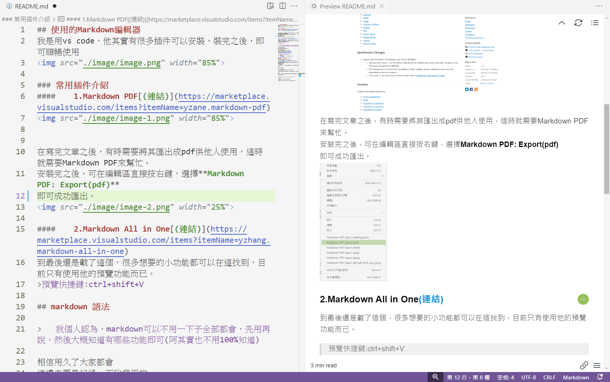
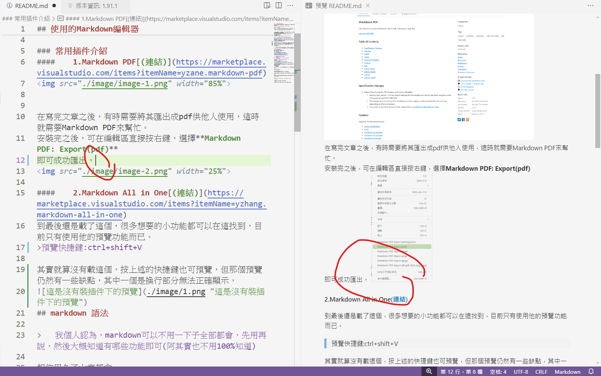

## 使用的Markdown編輯器
我是用vs code，他其實有很多插件可以安裝，裝完之後，即可順暢使用
  

### 常用插件介紹
####    1.Markdown PDF[(連結)](https://marketplace.visualstudio.com/items?itemName=yzane.markdown-pdf)



在寫完文章之後，有時需要將其匯出成pdf供他人使用，這時就需要Markdown PDF來幫忙。  
安裝完之後，可在編輯區直接按右鍵，選擇**Markdown PDF: Export(pdf)**  
即可成功匯出。


####    2.Markdown All in One[(連結)](https://marketplace.visualstudio.com/items?itemName=yzhang.markdown-all-in-one)
到最後還是載了這個，很多想要的小功能都可以在這找到，目前只有使用他的預覽功能而已。
>預覽快捷鍵:ctrl+shift+V  

其實就算沒有載這個，按上述的快捷鍵也可預覽([參考連結](https://youtube.com/shorts/ILgCcjoNung?si=RE32axd4Jm4hVGs6)  )，但那個預覽仍然有一些缺點，其中一個是換行部分無法正確顯示。



可以發現，有裝插件下的預覽對於換行會比較謹慎。若是沒有成功換行(上一行要有兩個空格)，會如實顯示，這樣對於日後的發布也較為順暢。
## markdown 語法

>   我個人認為，markdown可以不用一下子全部都會，先用再說，然後大概知道有哪些功能即可(阿其實也不用100%知道)  

相信用久了大家都會  
這邊主要是紀錄一下我常用的  
不一定每個人都適合~~~ 
### 語法整理 
放上幾個我覺得還不錯的語法整理:  
[MarkDown語法大全](https://hackmd.io/@eMP9zQQ0Qt6I8Uqp2Vqy6w/SyiOheL5N/%2FBVqowKshRH246Q7UDyodFA?type=book)

>   若還有不會的話自己Google
### 頁內書籤
1.  ctrl+shift+v = 在vs code 中開啟預覽  
2.  設定頁內書籤
標題部分:``` <h2 id="1">緣起</h2>```  
連結部分:```- [緣起](#1) ```
### 頁外頁內書籤
剛剛在網路上找到另一個更好用的方法  
[youtube](https://youtube.com/shorts/G5580-DxQuw?si=BW4Y6ribnmY752qM)  
簡單來說，除了可以在文章內可以跳轉，還可以跳到另外一篇文章的某個標題裡  
具體作法如下:  
```markdown
[顯示的字](##)  通常在這時候就會跳出選單來讓你選想要的標題  
```
重點就是那兩個##

### 調整圖片大小
HackMD 可以指定圖片的大小，其語法如下：
```

```
在最後加上=寬度x高度)即可，但這不是我們要的，因為我們不是用HackMD  

---
通常是用這個 **HTML img size 圖片大小設置**
```
第一種

第二種

```
