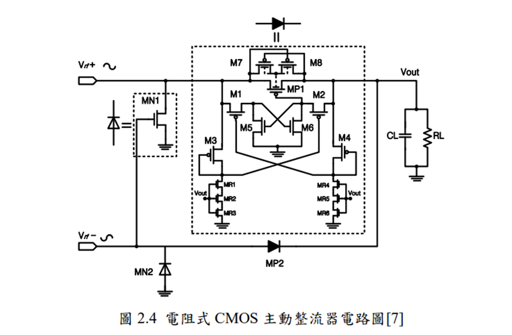
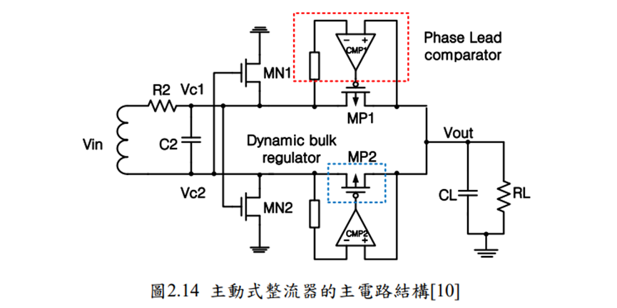
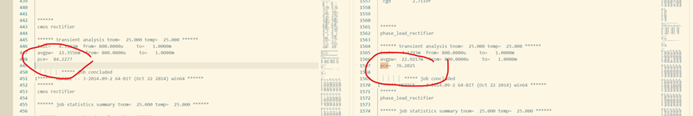
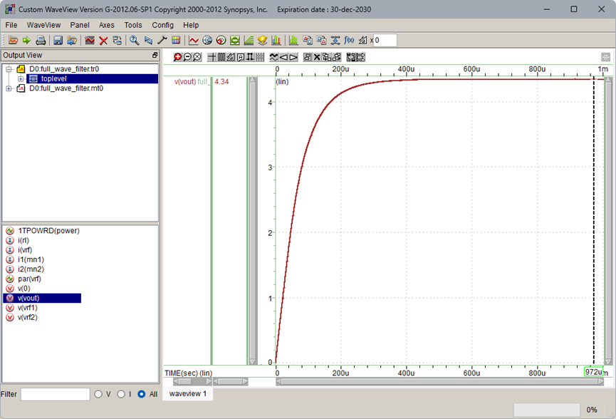
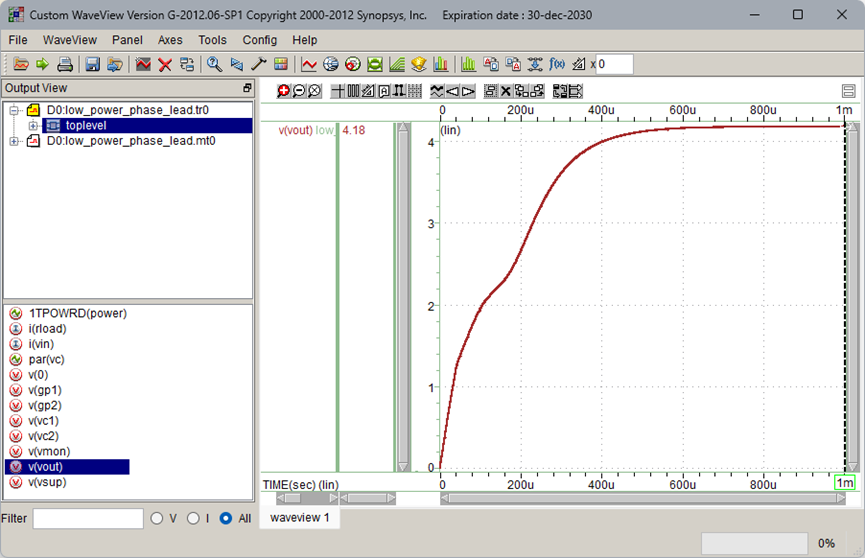

#   這是俺的專題進度日記
主要會依照日期順序一路寫下來

[描述文字/目录标题](#phase_lead.sp)

---
##  2024/0505
主要是做兩者電路的比較
我們讀的第一篇論文與第二篇論文()

### full_wave_filter.sp

```spice
CMOS rectifier
.option post
.lib    'cic018.l'  tt
xdiode1 vrf1    vout    diode   
xdiode2 vrf2    vout    diode

mn1     vrf1    vrf2    gnd     gnd     N_33        l=0.6u  w=20u   m=10
mn2     vrf2    vrf1    gnd     gnd     N_33        l=0.6u  w=20u   m=10

RL      vout    0       1k
CL      vout    0       1u

*m_name drain   gate    source  body    model_name  length  width
.subckt diode   vrf     vout    

mp1     vout    gmp1    vrf     dm7     P_33        l=0.5u  w=61.5u m=6

m1      dm1     gm1     vrf     vrf     P_33        l=0.5u  w=20u           
m2      gmp1    gm2     vout    vout    P_33        l=0.5u  w=20u           

m3      gm2     gm2     vrf     dm7     P_33        l=0.5u  w=12.78u                
m4      gm1     gm1     vout    vout    P_33        l=0.5u  w=12.78u    

m5      dm1     gmp1    gnd     gnd     N_33        l=0.5u  w=0.5u              
m6      gmp1    dm1     gnd     gnd     N_33        l=0.5u  w=0.5u      

m7      dm7     vout    vrf     dm7     P_33        l=0.5u  w=1u            
m8      dm7     vrf     vout    dm7     P_33        l=0.5u  w=1u    
mr1     gm2     vout    smr1    smr1    N_33        l=10u   w=1.79u     
mr2     smr1    vout    smr2    smr2    N_33        l=10u   w=0.88u
mr3     smr2    vout    gnd     gnd     N_33        l=10u   w=0.58u

mr4     gm1     vout    smr4    smr4    N_33        l=10u   w=1.79u 
mr5     smr4    vout    smr5    smr5    N_33        l=10u   w=0.88u
mr6     smr5    vout    gnd     gnd     N_33        l=10u   w=0.58u

.probe i1(mp1)  
.probe i2(m3)
.probe i3(m4)
.probe i4(m5)
.probe i5(m6)
.ends       

.probe i1(mn1)
.probe i2(mn2)

*v_name +node   -node   value
vgnd    gnd     0       0
vrf     vrf1    vrf2    sin(0   5   1Meg    0)

.meas    tran    iout    avg i(RL) from=800u to=1000u
.meas    tran    avgpw    avg(power)    from=800u    to=1000u
.meas    tran    PCE        param='(((iout^2)*1000)/avgpw)*100'
.probe vrf='v(vrf1)-v(vrf2)'
.tran    10n     1000u
.op 
.end
```
---
### phase_lead.sp

```
phase_lead_rectifier
.option post
.lib    'cic018.l'  tt
.param  w1=10u
.param  rl=1k
xcomp1      vsup    vc1     vout    gp1     comparator
xcomp2      vsup    vc2     vout    gp2     comparator
xp1     vc1     gp1     vout    dynamic_bulk
xp2     vc2     gp2     vout    dynamic_bulk

xp3     vsup    vsup    vc1     dynamic_bulk_2
xp4     vsup    vsup    vc2     dynamic_bulk_2
xp5     vsup    vmon    vout    dynamic_bulk_1
xvm     vout    vsup    vmon    voltage_monitor
m1      vc1     vc2     0       0       N_33        l=0.6u  w=20u   m=10
m2      vc2     vc1     0       0       N_33        l=0.6u  w=20u   m=10
csup    vsup    0   1n
cload   vout    0   1u
rload   vout    0   1k

.subckt comparator  vsup    v1  v2  out
*m_name drain   gate    source  body    model_name  length  width
mn1     d1      g1      s1      s1      N_33        l=1u    w=1u    
mn2     d2      v2      s1      s1      N_33        l=1u    w=1u
mn3     s1      bn1     s3      s3      N_33        l=1u    w=2u        
mn4     s3      bn2     0       0       N_33        l=1u    w=2u
mn5     d5      d5      0       0       N_33        l=1u    w=0.5u
mn6     d6      d5      0       0       N_33        l=1u    w=0.5u
mn7     d5      d6      0       0       N_33        l=1u    w=0.5u
mn8     d6      d6      0       0       N_33        l=1u    w=0.5u
*
mn9     d9      d5      0       0       N_33        l=1u    w=9u
mn10    out     d6      0       0       N_33        l=1u    w=9u

mns1    bn1     bn1     bn2     bn2     N_33        l=1u    w=2u
mns2    bn2     bn2     0       0       N_33        l=1u    w=2u
$ mns3  vsup    vsup    bn1     0       N_33        l=10u   w=1u
mns3    vsup    vsup    bn1     0       N_33        l=10u   w=0.5u

mp1     d1      bp1     vsup    vsup    P_33        l=1u    w=4u
mp2     d2      bp1     vsup    vsup    P_33        l=1u    w=4u                                                      
mp3     d5      bp2     d1      vsup    P_33        l=1u    w=2u
mp4     d6      bp2     d2      vsup    P_33        l=1u    w=2u
*
mp5     d9      d9      vsup    vsup    P_33        l=1u    w=18u
mp6     out     d9      vsup    vsup    P_33        l=1u    w=18u

mps1    bp1     bp1     vsup    vsup    P_33        l=1u    w=9u
mps2    0       0       bp1     bp1     P_33        l=5u    w=1u

mps3    bp2     bp2     vsup    vsup    P_33        l=1u    w=3u
mps4    0       0       bp2     bp2     P_33        l=1u    w=1u
cpoly   v1      g1      10p
$ cpoly v1      g1      10m
.ends

.subckt dynamic_bulk    vc      vgc     vo  
mp1     vc      vgc     vo      b1      P_33        l=0.6u  w=28u   m=10
mp1a    vc      vo      b1      b1      P_33        l=1u    w=1u    m=1
mp1b    b1      vc      vo      b1      P_33        l=1u    w=1u    m=1
.ends

.subckt dynamic_bulk_1  vc      vgc     vo  
mp1     vc      vgc     vo      b1      P_33        l=0.6u  w=50u   m=10
mp1a    vc      vo      b1      b1      P_33        l=1u    w=1u    m=1
mp1b    b1      vc      vo      b1      P_33        l=1u    w=1u    m=1
.ends

.subckt dynamic_bulk_2  vc      vgc     vo  
mp1     vc      vgc     vo      b1      P_33        l=0.6u  w=30u   m=5
mp1a    vc      vo      b1      b1      P_33        l=1u    w=1u    m=1
mp1b    b1      vc      vo      b1      P_33        l=1u    w=1u    m=1
.ends

.subckt voltage_monitor     vo      vsup    vmon
mp7     d7      d7      vo      vo      P_33        l=0.6u  w=1u    m=1
mp8     d8      d8      d7      d7      P_33        l=0.6u  w=1u    m=1
mp9     d8      d10     vo      vo      P_33        l=1u    w=1u    m=1
mp10    d10     d8      vo      vo      P_33        l=1u    w=1u    m=1
mp11    d11     d10     vo      vo      P_33        l=1u    w=1u    m=1
mp12    vmon    d11     vsup    vsup    P_33        l=1u    w=1u    m=1
$ mn0       0       d8      0       0       N_18        l=0.18u w=0.85u m=1
mn0     0       d8      0       0       N_18        l=0.6u  w=0.5u  m=1
mn1     d10     d8      0       0       N_33        l=1u    w=1u    m=1
mn2     d11     d10     0       0       N_33        l=1u    w=1u    m=1
mn3     vmon    d11     0       0       N_33        l=1u    w=1u    m=1

.ends

vin     vc1     vc2     sin(0   5   1x  0)
.probe vc='v(vc1)-v(vc2)'
.tran    10n     1000u $(sweep K 1u 12u 1u)
.meas    tran    iout    avg i(rload) from=800u to=1000u
.meas    tran    avgpw    avg(power)    from=800u    to=1000u
.meas    tran    PCE       param='(((iout^2)*1000)/avgpw)*100'
.op 100u 500u
.end
```
### 結果
.lis(左邊是full_wave_filter右邊是phase_lead)

####    full_wave_filter

####    phase_lead


---
### 老師的評語
