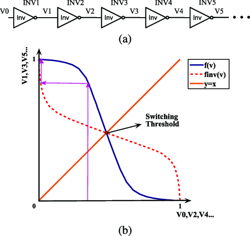
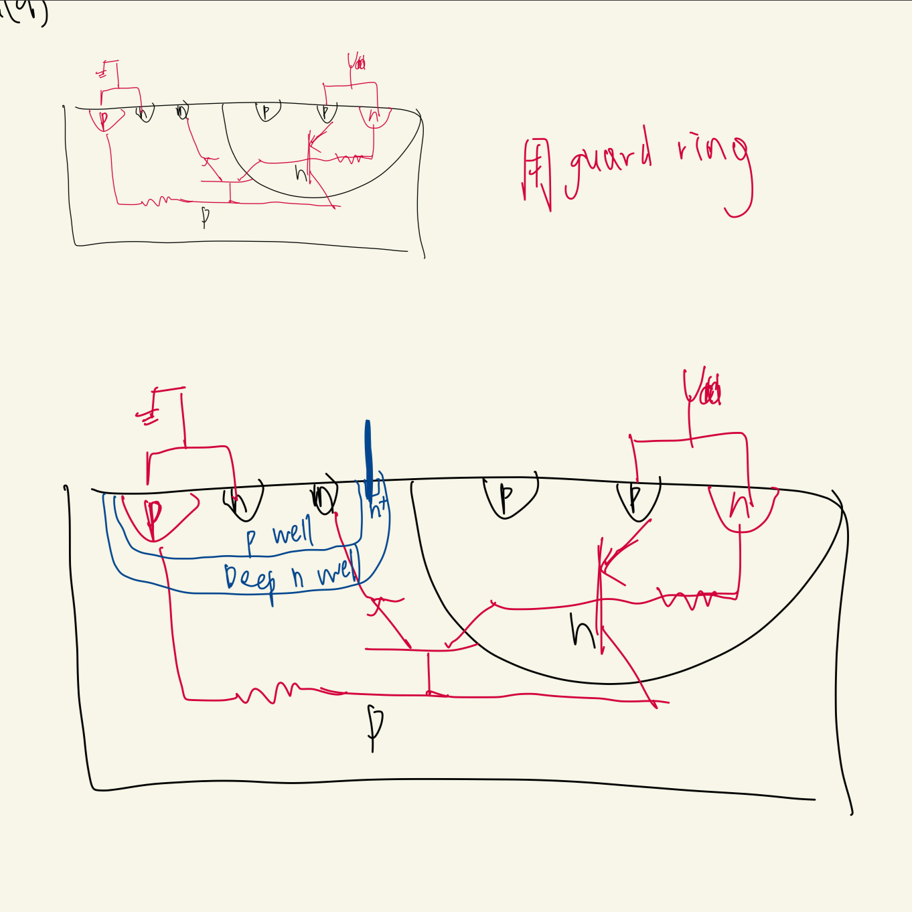
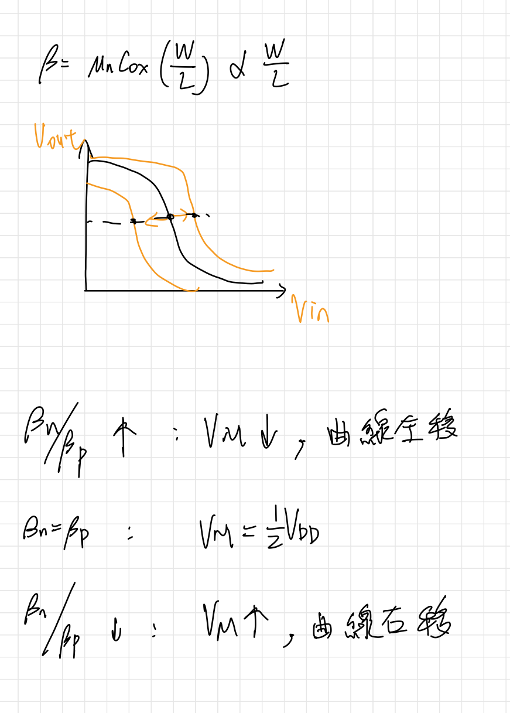
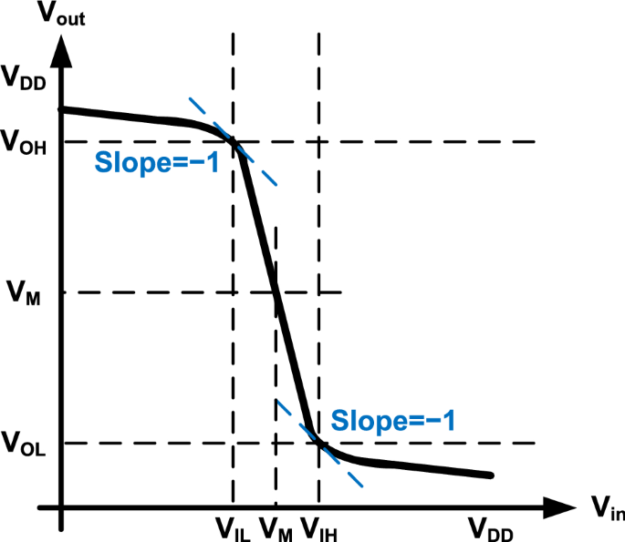
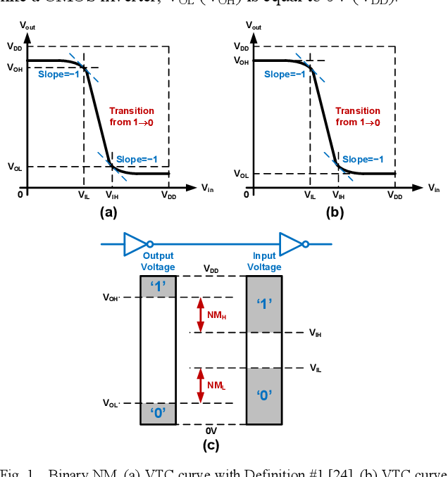
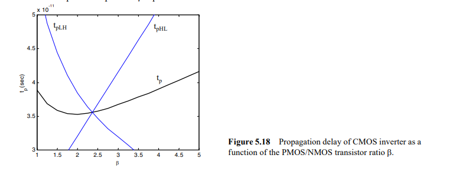
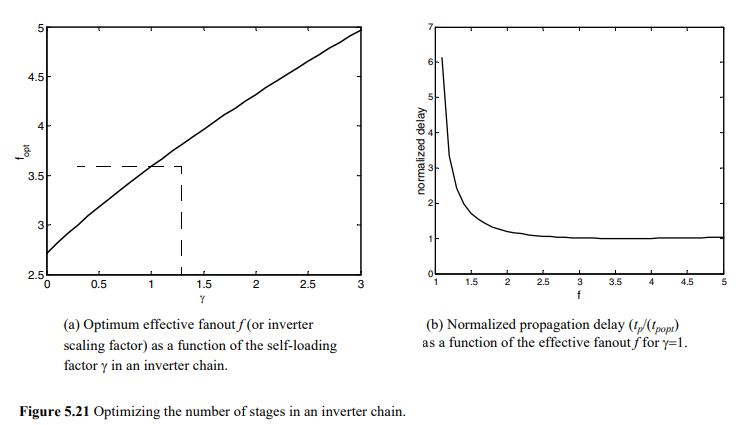
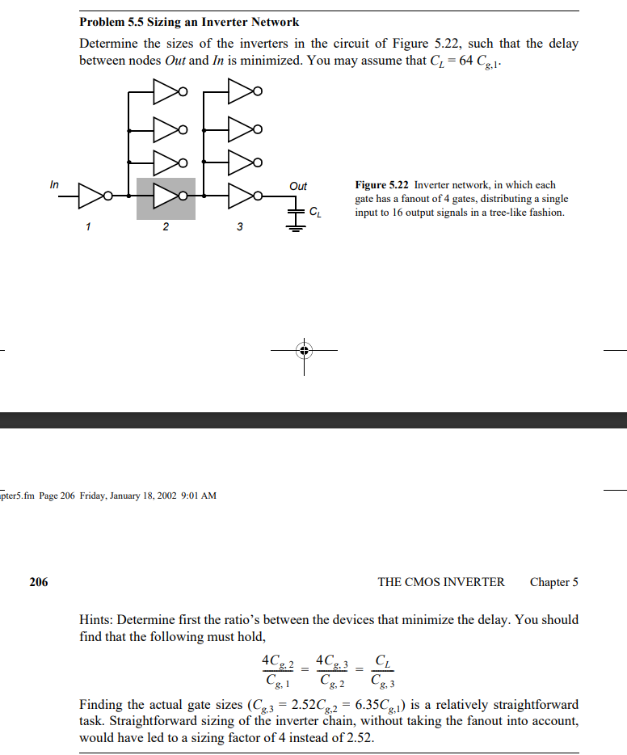

####  1.	Draw IV curve (MOS Region), Td vs VDD, Power vs. VDD. 
####  2.	Optimization difference between Delay and Power. 
####  3.	Directivity, Regenerative Property, Noise margin, Noise immunity.
#####   Directivity
直向性（Directivity）指的是系統或裝置對輸入訊號的反應方式。 在具有高直向性的系統中，輸入訊號只會在特定方向上產生明顯的反應，而在其他方向上則幾乎不會有反應。
#####   Regenerative Property
再生屬性（Regenerative Property）是指系統能夠通過增強信號的方式將輸入信號重建或放大。

#####   Noise margin
噪聲容限是指輸入信號可以受到多少噪聲的干擾而不影響系統正確運行的程度。
#####   Noise immunity
噪聲免疫性（Noise immunity）是指系統對噪聲的抵抗能力。
電路容忍雜訊訊號的能力稱為抗擾度，其定量測量稱為雜訊容限。
( The circuit's ability to tolerate noise signals is referred to as the noise immunity, a quantitative measure of which is called noise margin.)
####  4.	(a). Please describe what “latch-up” is, including the reason to result in latch-up, the concept of latch-up, and the problem bring from latch-up. (b). Please provide 3 approaches to prevent latch-up. 

指CMOS 晶片中在VDD和gnd之間出現低阻抗通路，使VDD gmd 之間產生電流，破壞晶片。

to prevent:
1.  避免source drain 的正向偏壓
2.  pFET加上一層n-well
nFET加上一層基板
3.  在input output 加上鉗位電路

####  5.	Fan-in, Fan-out 
**1.  Fan-in**
一個邏輯能對外提供輸入端的能力
**2.  Fan-out**
一個邏輯推動負載的能力
####  6.	Scaling Effect difference in MOS and Wire 
scaling effect:
尺寸小時，MOS速度 $\uparrow$，power $\uparrow$
wire小時，MOS速度 $\downarrow$，power $\downarrow$

####  7.	Why pull-up is PMOS, pull-down is NMOS? 
PMOS可以傳好的1
NMOS可以傳好的0
####  8.	How β affect VTC curve, Noise margin, Power, and Delay? 

當 $\beta_n\neq\beta_p$ 時，會導致nmos pmos 驅動力不同，導致電路出現額外功耗與delay

####  9.	Explain Fig. 5-18 

上升延遲與下降延遲大約在$\beta=2.4$達到相等
####  10.	Explain Fig. 5-21 

####  11.	Problem 5.5 

####  12.	Power Consumption Sources and their occurrence reasons. 
>Power Consumption=static + dynamic

static=leakage power 主要發生在mos沒有動作或靜止時，會有部分電流流失。
>dynamic power = internal(short circuit) power + switching power

internal(short circuit) power:短路功耗，pmos nmos 同時導通的功耗
switching power:開關時候的充放電消耗
####  13.	How to lower each power consumption sources? 
1.  dynamic
$P=C_L\times V^2_{DD}\times F_{clk}\times \alpha$
尺寸條小(將低附載電容)，降低電壓，降低clk頻率，降低轉向比率
2.  static
提升閥值電壓，降低電源電壓$\Rightarrow$降低次臨界電流功耗
3.  減少glitch

####  14.	Why leakage in advanced VLSI attracting our more attention?
leakage 功耗若是占比過高，會使晶片燒毀，因為它和溫度成指數關係
####  15.	The leakage is composed of gate leakage IG and subthreshold leakage Isub. How to lower each respectively?  
####  16.	Why smaller loading leads to larger short circuit power? 
####  17.	How leakage current sensitive to VDD, VG, Vth, Temp, Tox? 
|| leakage current |
| ------- | ------- |
| $V_{DD}\uparrow$ | $\uparrow$ | 
| $V_G\uparrow$ | $\uparrow$ (因因為漏電流面積$\uparrow$)| 
| $V_{th}\downarrow$ | $\uparrow$因為mos無法關閉電流 | 
| $Temp\uparrow$ | $\uparrow$ | 
| $T_{OX}\uparrow$ | $\downarrow$ 降低電子濃度| 
####  18.	What is glitch? How it affect circuit performance? How to reduce it? 
1.  What is glitch?
突波
2.  發生原因
signal 過慢或過快，導致邏輯運算單元出現短暫錯誤
3.  How it affect circuit performance?
造成運算出錯，功耗上升，
4.  How to reduce it? 
調整尺寸
####  19.	Design corner consideration
####  20.	(a). Please construct the function of G = (A+B)．(C·D+E) by using (1). Static CMOS, (2). pseudo-nmos, (3). pass transistor logic, (4). dynamic CMOS, (5). transmission gate, respectively. Please evaluate and rank the driving capability of these 5 circuits?
####  21.	Please design a 3-stage cascade domino-XOR circuit (A⊕B⊕C⊕D) that without problems of charge leakage, charge sharing, and cascade connection in dynamic CMOS circuits.  
####  22.	Please design a multi-mode 8-bit comparator, which can be selected to operate in 10KHz (low power mode) or 500MHz (high-speed mode).
####  23.	Please design a multi-mode 8-bit comparator, which can be selected to operate in normal VDD or half VDD, under the same speed.
####  24.	What are the advantages of TSPC D-plip-flop?
TSPC:True Single Phase Clock 單一相位時脈，只使用一個clk
####  25.	How to solve the setup time violation? How to solve hold-time violation? How to let setup time to be shorter? How to let hold-time to be shorter? How to let CLK to Q delay to be shorter? How to let PVT variation to be smaller? How to tolerate PVT variation?
